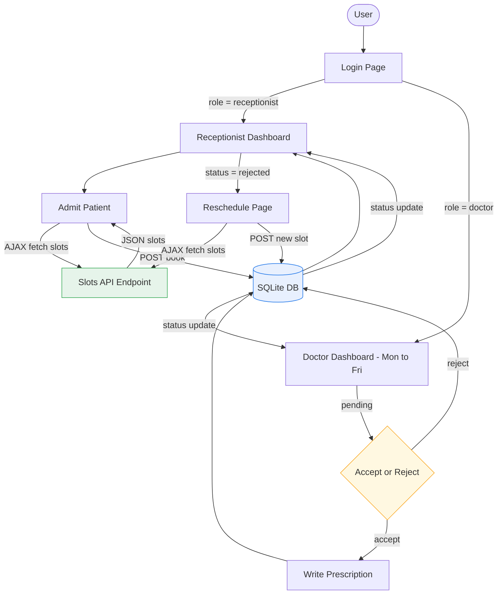

# 🏥 Hospital Management System

A lightweight, role-based web application for managing hospital appointments between receptionists and doctors.

---

## Tech Stack

| Layer | Technology |
|---|---|
| Backend | Python 3, Flask, Flask-Login, Flask-WTF |
| Database | SQLite via Flask-SQLAlchemy |
| Frontend | Jinja2 templates, vanilla JS (AJAX fetch) |
| Auth | Werkzeug password hashing, session-based login |
| Forms | WTForms with CSRF protection |

---

## Features

- **Receptionist** — admit patients, book appointments (weekdays only, 7-day window, 1-hr buffer), reschedule rejected ones
- **Doctor** — view the full week's appointments (Mon–Fri), accept/reject, write/edit prescriptions
- **Smart slot logic** — rejected slots hidden per doctor per date; other doctors still see them
- **Returning patients** — matched by name + contact; history preserved across visits

---

## Project Structure

```
hospital-management/
├── app.py                  # App factory, seeding, login manager
├── config.py               # SQLite URI, secret key
├── models.py               # SQLAlchemy models
├── forms.py                # WTForms form classes
├── routes/
│   ├── auth.py             # Login / logout
│   ├── receptionist.py     # Patient admission, booking, reschedule, slots API
│   └── doctor.py           # Dashboard, accept/reject, prescribe
├── templates/
│   ├── base.html
│   ├── login.html
│   ├── add_patient.html
│   ├── receptionist_dashboard.html
│   ├── doctor_dashboard.html
│   ├── prescribe.html
│   └── reschedule.html
└── static/
    └── style.css
```

---

## Architecture & Flow



---

## Data Models

```
User ──────────< Appointment >────────── Patient
(doctor /           │
 receptionist)      │
                    └──── Prescription
```

- One **User** (doctor) has many Appointments
- One **Patient** has many Appointments
- One **Appointment** has at most one **Prescription**

---

## Getting Started

```bash
pip install flask flask-login flask-sqlalchemy flask-wtf
python app.py
```

Default accounts created on first run:

| Role | Username | Password |
|---|---|---|
| Receptionist | `receptionist1` | `rec123` |
| Doctor | `doctor1` | `doc123` |

---

## Slot Booking Rules

- **Weekdays only** (Mon – Fri); weekends blocked in UI and server
- **7-day window** — cannot book beyond one week from today
- **1-hour buffer** — same-day slots within 1 hr of current time are hidden
- **Rejected slots** — hidden only for the doctor who rejected them on that date; visible for other doctors